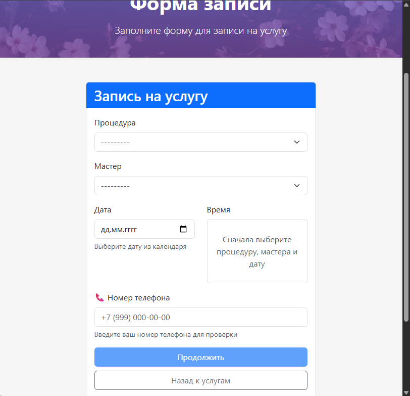
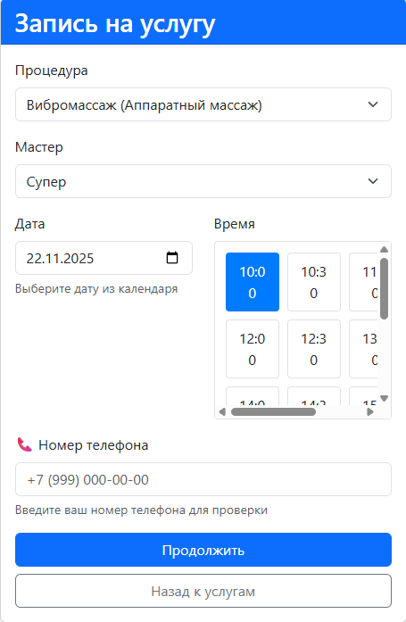

# 🏪 Салон красоты "АлЁнкА" - Система бронирования


Система онлайн-записи на процедуры с автоматическими уведомлениями.

## 🚀 Основные возможности

### 📅 Бронирование процедур
- Выбор процедуры из каталога
- Выбор мастера  
- Выбор даты и времени
- Проверка доступности времени




### 🔔 Умные уведомления
- **Telegram** - мгновенные уведомления через бота
- **Email** - уведомления на почту
- Клиент выбирает предпочтительный способ связи

### 💰 Система оплаты
- Автоматическое определение необходимости предоплаты
- Уведомления о предоплате для новых клиентов
- Отслеживание статуса оплаты

### 👥 Управление клиентами
- Автоматическое создание карточек клиентов
- Сохранение истории записей
- Интеграция с Telegram для уведомлений

### 🔔 Система напоминаний
- Автоматические напоминания о записях
- Подтверждение/отмена через Telegram кнопки
- Настраиваемое время напоминаний

## 🛠 Технологии
- **Backend**: Django 3.2, Python 3.9
- **Frontend**: Bootstrap 5, JavaScript
- **База данных**: SQLite (разработка) / PostgreSQL (продакшн)
- **Уведомления**: Telegram Bot API, SMTP
- **Контейнеризация**: Docker, Docker Compose
- **Веб-сервер**: Nginx, Gunicorn

## 📋 Установка и запуск

### 1. Клонирование репозитория
```bash
git clone https://github.com/Kosmonaffter/Alenka-Beauty-Salon.git
cd Alenka-Beauty-Salon/backend
```
2. Создание виртуального окружения
```bash
python -m venv venv
source venv/bin/activate  # Linux/Mac
venv\Scripts\activate     # Windows
```
3. Установка зависимостей
```bash
pip install -r requirements.txt
```
4. Настройка окружения
Создайте файл .env в корне проекта:
```bash
# Обязательные настройки
DEBUG=True
SECRET_KEY=your-secret-key-here
TELEGRAM_BOT_TOKEN=your-bot-token
TELEGRAM_ADMIN_CHAT_ID=your-chat-id

# База данных (для Docker)
POSTGRES_DB=django_pro
POSTGRES_USER=django_user
POSTGRES_PASSWORD=django_password

# Email уведомления
EMAIL_HOST=smtp.yandex.ru
EMAIL_PORT=587
EMAIL_HOST_USER=your-email@yandex.ru
EMAIL_HOST_PASSWORD=app-password
DEFAULT_FROM_EMAIL=your-email@yandex.ru

# Домен
DOMAIN_NAME=localhost
ALLOWED_HOSTS=localhost,127.0.0.1
```
5. Миграции и суперпользователь
```bash
python manage.py migrate
python manage.py collectstatic
python manage.py createsuperuser
python manage.py runserver
```
6. Инициализация данных
```bash
python manage.py init_telegram_bot
python manage.py init_payment_settings
```
7. Запуск разработческого сервера
```bash
python manage.py runserver
```

## 🐳 Быстрый запуск через Docker

```bash
# Клонирование и запуск
git clone https://github.com/Kosmonaffter/Alenka-Beauty-Salon.git
cd Alenka-Beauty-Salon

# Запуск всех сервисов
docker-compose up -d

# Создание администратора
docker-compose exec backend python manage.py createsuperuser

# Открыть в браузере
http://localhost
```

⚙️ Команды управления
Телеграм бот:
```bash
# Диагностика бота
docker-compose exec backend python manage.py diagnose_bot

# Тест уведомлений  
docker-compose exec backend python manage.py test_notification

# Установка вебхука
docker-compose exec backend python manage.py setup_webhook
```

Напоминания:
```bash
# Отправка напоминаний
docker-compose exec backend python manage.py send_reminders
```

🤖 Настройка Telegram бота
1. Создание бота
Найти @BotFather в Telegram

Создать нового бота командой /newbot

Получить токен и добавить в .env

2. Настройка вебхука
```bash
python manage.py setup_telegram_webhook --domain your-domain.com --https
```

3. Активация клиентами
Клиенты должны:

Перейти в @HiSaloonBot
Нажать START
Отправить номер телефона через кнопку
Получать уведомления о статусе записей

📧 Настройка Email
Для Yandex почты:
``` python
EMAIL_HOST = 'smtp.yandex.ru'
EMAIL_PORT = 587
EMAIL_USE_TLS = True
EMAIL_HOST_USER = 'your-email@yandex.ru'
EMAIL_HOST_PASSWORD = 'пароль-приложения'
```
🗃 Модели данных
Основные модели:
Procedure - процедуры/услуги

Master - мастера

Client - клиенты

Booking - записи на процедуры

WorkingHoursSettings - настройки рабочего времени

Уведомления:
TelegramBot - настройки бота

ClientChat - связь телефонов с Telegram chat_id

🔧 Администрирование
Доступ к админке: /admin/

Основные разделы:
Бронирования - управление записями, изменение статусов

Клиенты - просмотр клиентской базы

Процедуры - управление услугами

Мастера - управление персоналом

Telegram боты - настройка уведомлений

📞 Процесс записи клиента
Выбор услуги → Клиент выбирает процедуру из каталога

Выбор мастера → Система показывает доступных мастеров

Выбор времени → Показывает свободные слоты с учетом длительности

Подтверждение → Клиент вводит имя и выбирает способ уведомлений

Уведомление мастеру → Бот отправляет заявку мастеру

Подтверждение → Мастер подтверждает или отменяет запись

Уведомление клиенту → Клиент получает результат выбранным способом

🚀 Деплой
Продакшн настройки:
python
DEBUG = False
ALLOWED_HOSTS = ['your-domain.com', 'www.your-domain.com']
STATIC_ROOT = '/path/to/static/files'
Сборка статики:
```bash
python manage.py collectstatic
Настройка Nginx:
nginx
server {
    listen 80;
    server_name your-domain.com;
    
    location /static/ {
        alias /path/to/static/files/;
    }
    
    location /media/ {
        alias /path/to/media/files/;
    }
    
    location / {
        proxy_pass http://127.0.0.1:8000;
        proxy_set_header Host $host;
        proxy_set_header X-Real-IP $remote_addr;
    }
}
```
🐛 Решение проблем
Telegram бот не отвечает:
Проверить токен в .env
Проверить настройки вебхука
Убедиться что бот активен в админке

Email не отправляются:
Проверить SMTP настройки
Убедиться в правильности пароля приложения
Проверить спам-фильтры

Время не отображается:
Проверить настройки рабочего времени
Убедиться что мастер активен
Проверить существующие бронирования

👨‍💻 Разработка
## 🏗️ Структура проекта
```python
django_pro/
├── backend/ # Django бэкенд
│ ├── about/ # Приложение о компании
│ ├── booking/ # Бронирования
│ ├── catalog/ # Каталог процедур
│ ├── masters/ # Мастера
│ ├── notifications/ # Уведомления
│ ├── user/ # Пользователи
│ ├── homepage/ # Главная страница
│ ├── django_pro/ # Настройки проекта
│ └── manage.py
├── frontend/ # Фронтенд
│ ├── templates/ # HTML шаблоны
│ └── static/ # Статические файлы
├── docker-compose.yml
└── README.md
```
Добавление новой процедуры:
В админке: Каталог → Процедуры → Добавить
Заполнить: название, описание, цену, длительность
Назначить мастеров
Активировать процедуру

### Еще не допилено:
## 🔔 Система напоминаний
# Автоматические напоминания:
- 📅 Напоминание о записи за 24 часа
# Запуск напоминаний:
```bash
# Ручной запуск
docker-compose exec backend python manage.py send_reminders

# Автоматизация (cron)
0 * * * * cd /path/to/project && docker-compose exec backend python manage.py send_reminders
```

📞 Поддержка
По вопросам работы системы обращайтесь:

Email: kosmonaffter@yandex.ru

Telegram: @kosmonafftsb

Салон красоты "АлЁнкА" © 2025
